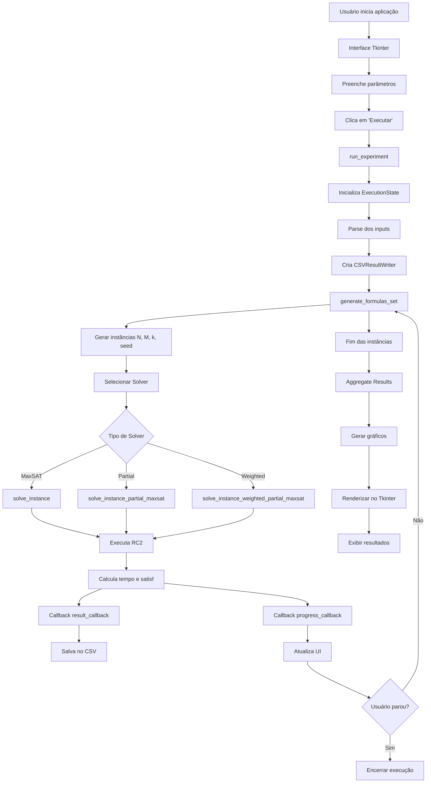

# 🧠 Experimentos com Max-SAT utilizando RC2 (PySAT)

Este projeto tem como objetivo a **geração, execução e análise experimental de instâncias de problemas SAT/Max-SAT**,
utilizando o solver **RC2** da biblioteca PySAT.

A aplicação foi desenvolvida com foco acadêmico, permitindo estudar o comportamento de instâncias aleatórias de k-SAT,
com ênfase em:

- desempenho computacional
- satisfazibilidade
- análise estatística
- observação da **transição de fase**

Além disso, o sistema fornece uma **interface gráfica interativa**, permitindo ao usuário configurar experimentos,
acompanhar a execução em tempo real e visualizar os resultados por meio de gráficos.

## 📌 Funcionalidades

O sistema implementa um pipeline completo de experimentação:

### 🔹 Geração de instâncias

- Geração de fórmulas CNF aleatórias do tipo **k-SAT**
- Garantia de:
    - ausência de repetição de variáveis em cláusulas
    - diversidade estatística das instâncias
- Controle por parâmetros:
    - número de variáveis (N)
    - número de cláusulas (M)
    - número de literais por cláusula (k)

### 🔹 Tipos de problemas suportados

- **Max-SAT**
- **Partial Max-SAT**
- **Weighted Partial Max-SAT**

Cada variante possui comportamento distinto em relação às cláusulas (hard/soft/pesos).

### 🔹 Execução paralela

- Uso de `ProcessPoolExecutor`
- Distribuição automática de carga (~70% da CPU)
- Processamento incremental (streaming de resultados)

### 🔹 Controle de execução

- Execução assíncrona (não bloqueia a interface)
- Possibilidade de interrupção segura
- Gerenciamento de estado global (start/stop)

### 🔹 Persistência de dados

- Escrita incremental em CSV
- Proteção contra perda de dados em execuções longas
- Nomeação automática baseada nos parâmetros

### 🔹 Visualização

- Geração automática de gráficos:
    - Satisfazibilidade
    - Tempo médio
    - Tempo com desvio padrão
    - Gráfico combinado

### 🔹 Reuso de dados

- Carregamento de CSV previamente gerado
- Replotagem sem reexecução do experimento

## 🏗️ Arquitetura do Projeto

O sistema foi estruturado em camadas bem definidas, separando responsabilidades:

```text
core/
  ├── cnf_generator.py   # Geração de fórmulas CNF (k-SAT)
  ├── sat_core.py        # Execução dos solvers (RC2)
  ├── models.py          # Estruturas de dados (inputs, resultados, estatísticas)
  ├── solver_type.py     # Enum de tipos de solver
  └── stats.py           # Agregação estatística

infra/
  └── csv_writer.py      # Persistência e leitura de resultados

ui/
  ├── gui.py             # Interface principal (Tkinter)
  └── components.py      # Componentes reutilizáveis de UI

utils/
  └── execution.py       # Controle de execução (estado global)

visualization/
  └── graphs.py          # Geração de gráficos (matplotlib)

main.py                  # Ponto de entrada
```

### 🔎 Observação arquitetural

O projeto segue uma separação clara entre:

- **domínio (core)**
- **infraestrutura (infra)**
- **interface (ui)**
- **visualização (visualization)**

Isso facilita manutenção, testes e evolução futura.

## ⚙️ Requisitos

- Python 3.10+

### 🐍 Ambiente virtual (recomendado)

Para evitar conflitos de dependências, recomenda-se utilizar um ambiente virtual.

#### Criar ambiente virtual

```bash
python -m venv venv
```

#### Ativar o ambiente

**Windows:**

```bash
venv\Scripts\activate
```

**Linux/macOS:**

```bash
source venv/bin/activate
```

#### Instalar dependências

Com `requirements.txt`:

```bash
pip install -r requirements.txt
```

> Caso necessário, você também pode instalar manualmente:
>
> ```bash
> pip install python-sat matplotlib numpy
> ```

## ▶️ Execução da aplicação

```bash
python main.py
```

## 🖥️ Interface da Aplicação

A interface gráfica permite configurar os seguintes parâmetros:

- Número de fórmulas por amostra
- Número de variáveis (N)
- Literais por cláusula (k)
- Intervalo de cláusulas (M mínimo e máximo)
- Seed (opcional)
- Tipo de solver

### 🎮 Controles disponíveis

- **Executar Experimento** → inicia processamento
- **Parar** → interrompe execução
- **Carregar dados** → abre CSV existente

### 📊 Feedback em tempo real

- Tempo de execução
- Progresso (instâncias processadas)
- Barra de progresso
- Spinner de inicialização

## 🧪 Metodologia Experimental

O fluxo de execução segue as seguintes etapas:

### 1. Geração das instâncias

Para cada valor de M no intervalo definido:

- são geradas múltiplas fórmulas (amostras)
- cada instância recebe uma seed própria

### 2. Modelagem do problema

Dependendo do solver:

- Max-SAT → todas cláusulas soft
- Partial → divisão hard/soft
- Weighted → soft com pesos variados

### 3. Execução do solver

- Utilização do RC2 (PySAT)
- Cálculo do custo mínimo (cláusulas não satisfeitas)

### 4. Coleta de métricas

Para cada instância:

- tempo de execução
- satisfazibilidade

### 5. Agregação estatística

Agrupamento por M:

- média
- desvio padrão

### 6. Visualização

Geração de gráficos para análise do comportamento do sistema

## 📊 Métricas analisadas

### 🔹 Satisfazibilidade

Proporção de cláusulas satisfeitas:

```text
satisf = (peso_total - custo) / peso_total
```

### 🔹 Tempo de execução

Tempo necessário para resolução de cada instância

### 🔹 Desvio padrão

Mede a variabilidade dos resultados:

- importante para análise de instabilidade
- relevante próximo à transição de fase

## 📈 Visualizações

### 🔹 Gráfico combinado

- Satisfazibilidade (%) vs M
- Tempo médio vs M

Permite observar simultaneamente:

- transição de fase
- crescimento do custo computacional

### 🔹 Gráfico de satisfazibilidade

- Identifica a queda abrupta (transição de fase)

### 🔹 Gráfico de tempo

- Mostra crescimento exponencial do custo

### 🔹 Gráfico com desvio padrão

- Evidencia variabilidade dos resultados

## 💾 Persistência de dados

Os resultados são salvos automaticamente em:

```text
/resultados/
```

Formato do arquivo:

```text
timestamp_solver_N_k_f_M-range_seed.csv
```

Exemplo:

```text
20260323_153000_MaxSAT_N100_k3_f10_M100-500_seed42.csv
```

## 🔄 Reprodutibilidade

- Seed fixa → resultados determinísticos
- Seed ausente → diversidade estatística

## 🧵 Execução Paralela

- Uso de múltiplos processos
- Aproveitamento de CPU
- Execução incremental
- Balanceamento dinâmico de tarefas

## 🛑 Controle de Execução

- Interrupção segura via estado global
- Não há perda de dados já processados
- Interface permanece responsiva

## 📚 Base Teórica

O solver utilizado é o:

### 🔹 RC2 (Max-SAT Solver)

Baseado em:

- relaxação por cardinalidade
- otimização incremental

Retorna:

- custo mínimo (cláusulas não satisfeitas)

## 🎯 Objetivo

O projeto foi desenvolvido com fins acadêmicos, visando:

- Estudo experimental de SAT/Max-SAT
- Análise de desempenho de solvers
- Observação da transição de fase
- Apoio a trabalhos como TCC

## 🚀 Possíveis Evoluções

- Integração com Pandas
- Exportação para notebooks
- Suporte a outros solvers
- Armazenamento em banco
- Interface web (FastAPI / Next.js)

## 📄 Licença

Uso acadêmico e educacional.

## 🧠 Diagrama de Fluxo

